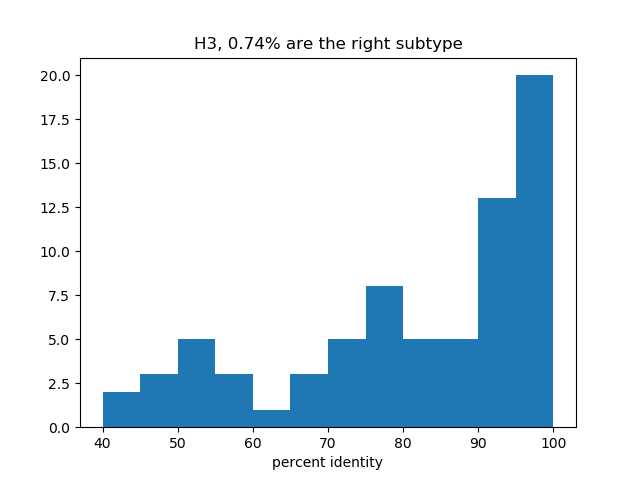

This document is primarily to document my progress and conclusions from working on this project. For usage instructions, see `README.md`.

Lab: King Lab, Institue for Protein Design, University of Washington

Author: Conlan Olson

Date: Summer 2019

___NOTE___: _I had the project working fairly well when I did a group meeting presentation on 08/01/2019 but since then I've changed a lot about the model architectures (mostly, how the batch normalization works). I'm not sure yet that this new stuff works better. So, I included a snapshot of this project when it was working decently as a fall back at `flu_08012019/`. Another thing to keep in mind is that most of the figures in this report were produced by the old model._

# Project goals
This project was intended to create a flexible model capable of generating realistic but synthetic hemagglutinin sequences that can be tuned for a variety of purposes. I approached it from a machine learning perspective. Keep in mind that I do not have a background in biology.

One of the first papers I found was [this one](https://arxiv.org/abs/1712.06148) from Killoran et al. at the University of Toronto where they used machine learning to generate and tune DNA sequences. My project followed the overall structure of theirs in that I created a generative model, a predictor model, and used the two back-to-back to tune the outputs of the generator. Another useful paper that uses machine learning for protein design is [here](https://arxiv.org/abs/1801.07130).

The rest of this report will treat the model as a modular system that requires:
1. A generator model to produce hemagglutinin sequences
2. A predictor to score how "good" a sequence is for a certain design constraint
3. True hemagglutinin sequences to learn from

# The generative model
The first type of training paradigm I tried was a [GAN (generative adversarial model)](https://arxiv.org/abs/1406.2661), but a GAN never worked for me. I used a Wasserstein GAN with the training method from [this paper](https://arxiv.org/abs/1704.00028) to try to stabilize the training. I tried a variety of architectures, including some fully connected and some convolutional and used a lot of different choices for hyperparameters. The training was always extremely slow and never produced realistic-looking sequences (and even sometimes collapsed completely into generating strings of 'A's). I ended up dropping, but there is no reason why a GAN shouldn't work for this problem. You can see what I think is my best implementation of a GAN in `generator.py` with the `--model=gan` option, but it still doesn't work.

I moved to using a [VAE (variational autoencoder)](https://arxiv.org/abs/1312.6114) which worked really well. Below are some of the options I've tried.

## VAE design and hyperparameters
### Architecture
I first tried a simple fully-connected architecture (`--model=vae_fc`). The encoder has dimensions 576 x 22 -> 512 -> 512 -> 256 -> latent dimension (technically, the last dimension is 2 x latent dimension and the first half are treated as means and the second half are treated as standard deviations for the latent variables). The decoder is 100 -> 512 -> 512 -> 256 -> 576 x 22. I used leaky ReLU activations. This architecture worked very well and I used it for most of the project.

However, it makes sense that a convolutional architecture (`--model=vae_conv`) would work well for this problem, so at the suggestion of Nao I tried a convolutional VAE with 3 layers (the middle two of which are residual) with a filter size of 5 throughout the whole model (see `generator.py` with the `--model=vae_conv` for details). I tried varying the number of channels in the residual layers to tweak the expressiveness of the model. I used 64 for a while but I have tried to go lower. If I want to use lower latent dimensions (see below) I bump it back up to 64. This can be changed with `--channels`.

At one point, I also tried a recurrent network that allowed flexible-length sequence-to-sequence encoding. It used LSTM cells. I wasn't able to train this though, but it is still implemented as `--model=vae_lstm`.

### Latent dimension
I used a latent dimension of 100 for most of the project, which worked fine. However, I was getting problems with unrealistic outputs, so (again at the suggestion of Nao) I tried reducing the latent dimension to constrain the model to be a bit more realistic. I've tried values from 2-100. With the fully-connected architecture, even 2 works ok. However, the convolutional architecture, being less expressive, can't go below around 20. This can be changed with `--latent_dimension`.

### Beta VAE
Following [this paper](https://openreview.net/forum?id=Sy2fzU9gl) which tries to "disentangle" the latent space by multiplying the KL loss by a parameter greater than 1, I set this parameter equal to 5 when I trained the VAEs. This can be changed with `--beta`.

### Training
When a model is trained for the first time, I use a simulated annealing protocol to ramp up the KL loss from 0 to beta. I generally trained models for 300 ish epochs, going back for more if it looked like they needed it. I think the big complicated fully connected VAE I used for a while probably got a total of about 2000 epochs of training.

### Batch normalization
I used batch normalization to speed up training (and prevent weird runaway training where the loss would go to NaN and the sequences would just be all A's).

# The predictor
## Subtype predictor
I trained a residual neural network to predict subtypes from sequences, which worked well. Initially I gave it 5 residual blocks, each with two convolutional layers, but I suspect this was way overkill. I've since reduced the number of layers. This problem is easy, the predictor gets >99% accuracy on a test set with quick training.

For fun, I also looked at a saliency map to see what the model picks up on. It seems to care about a few single-point mutations that distinguish subtypes, as well as motifs in different locations, indicating an insertion/deletion.


## Head/stem predictor
So I could tune the head and stem subtype separately, I also trained a subtype predictor that was only allowed to look at the stem domain and one that was only allowed to look at the head domain. For this project, I defined the head as residues 135-277, though I've sinced learned that a more standard definition is 46-278. 

## Design
So I could tune certain positions having certain residues, I also implemented a way to take the crossentropy between a specific residue and a target residue.

# The training data
I searched for all complete HA sequences on fludb.org and got about 87,000 sequences. I used 40,000 for training. I tried to align them using MUSCLE and got crazy gaps everywhere because there were so many (even though I did them in batches of 2,500). I decided that my model was probably learning to compensate for misalignment anyways so I didn't align the sequences for most of the project.

I encoded each amino acid as a one-hot vector with length 22 (20 amino acids, 1 unknown, 1 gap). I am also trying to encode each amino acid with its row in a replacement matrix like BLOSUM62. These rows can be interpreted as the log probability distribution of a residue over all amino acids. This would give the model some knowledge about which aa's are similar and which are really important to keep exactly the same. Using this encoding tends to result in models that train but are very hard to tune. I don't know why this is and am still working on it.

# Searching for good hyperparameters
I did a big scan of possible hyperparameters for fully connected and convolutional VAEs. I checked values of 2, 5, 10, 20, and 100 for the latent dimension. Also, for the convolutional VAEs, I tried 16, 32, and 64 for the number of channels. I trained each model for 5000 epochs and then tried to find a H5 by tuning. The result of each of these runs is in `scan_results/` (first number in a file is latent dimension, second is channels if applicable). 

The most complicated/rich models train the easiest.

# Results
## Ways of validating the model
Here are some things I did to see if the outputs I was getting were any good. 
1. By outputting a bunch of sample sequences and making a sequence logo out of them, you can see whether the sequences get the highly conserved vs variable locations in real hemagglutinin.
2. Inputting sequences into BLAST can tell you what the nearest match in the PDB is to the synthetic sequence, what subtype it is, and the percent identity between the generated sequence and the real sequence. 
3. Submitting generated sequences to HMMER can compare them to profile HMMs to give a score of how related they are to the hemagglutinin sequence profile.
4. Using Rosetta with the Hybridize protocol to do comparative modeling and get structure predictions on generated sequences can tell you how realistic they are if you look at scores. 
5. Exploting the latent space by hand.

## Results
### Sequence logo
The sequence logo made out of aligned generated samples shows that the model does learn which residues are highly conserved and which are variable. It does usually get the highly conserved residues and motifs.


### Using BLAST to compare to real HAs
When putting samples into BLAST, the samples that it was easy to tune for (for example, tuning for subtype 1) were good at matching with that subtype and had high (>90%) percent identities. The harder ones (for example, tuning for subtype 8) often didn't match with an 8 and the sequence identities were lower. Similarly, when tuning for a chimeric HA, the sequence identities were fairly low (30-60%).

Histograms:





(Colors are subtype, blue is H1 and green is H3)


### Rosetta modeling
There was a good correlation between Rosetta score and percent similarity to a PDB protein:


The weirder generated samples often had problems such as:
* Missing highly conserved cysteines to make disulfide bonds (green is generated, blue is a real HA):
    
    
* Mutating hydrophobic resides in the core to polar ones (without satisfying hydrogen bonds):


* (Rarely) messing up highly conserved residues in the receptor binding site:


### Design
"Designing" residues works well, but can sometimes result in unrealistic proteins if you are asking for something two weird. It works nicely to design in the whole RBS.

### Other experiments
* You can look at compensatory mutations by designing in a whole sequence, then changing a few positions and giving them a high weight. Then the model has to make those mutations while staying close to the original sequence. The problem with this is that I was having trouble finding the right balance between a model that was not so flexible that it just made the mutation straight-up (even if it was unrealistic) but also flexible enough that it could compensate -- sometimes the model would just switch to a whole different protein.
* It's also fun to look at interpolations between sequences. You can do this by generating two sequences (or tuning to generate any sequence that you want) and printing their latent variable representations, then printing the decoding of latent variables at various points along a line connecting the two.

```
MEKIVLLLAIINLVKSDQICIGYHANNSTEQVDTIMEKNVTVTHAQDILEKTHNGKLCDLDGVKPLILRDCSVAGWLLGNPMCDEFLNVSEWSYIVEKINPANDLCYPGNFNDYEELKHLLSRINHFEKIQIIPKSSWSDHEASSGVSSACPYQGRSSFFRNVVWLIKKNNAYPTIKXSYNNTNQEDLLVLWGIHHPNDAAEQTRLYQNPTTYISVGTSTLNLFLVPKIATRSKVNGQSGRMEFFWTILKPNDAINFESNGNFIAPENAYKIVKKGDSTIMKSELEYGNCNTKCQTPIGAINSSMPFHNIHPLTIGECPKYVKSNRLVLATGLRNSPQGERRRKKRGLFGAIAGFIEGGWQGMVDGWYGYHHSNEQGSGYAADKESTQKAIDGVTNKVNSIIDKMNTQFEAVGREFNNLERRIENLNKKMEDGFLDVWTYNAELLVLMENERTLDFHDSNVKNLYDKVRLQLRDNAKELGNGCFEFYHRCDNECMESVRNGTYDYPQYSEEARLKREEISGVKLESIGTYQILSIYSTVASSLALAIXVAGLSLWMCSNGSLQCRXCIXFMRXXXL
MEKIVLLLATISLVKSDQICIGYHANNSTEQVDTIMEKNVTVTHAQDILEKTHNGKLCDGDGVKPLILRDCSVAGWLLGNPMCDEFLNVSEWSYIVEKINPANDLCYPGNFNDYEELKHLLSRINHFEKIQIIPKSSWSDHDASSGVSSACPYQGRSSFFRNVVWLIKKNNAYPTIKTSYNNTNQEDLLVLWGIHHPNDAAEQTRLYQNPTTYISVGTSTLNLFLVPKIATRSKVNGQSGRMEFFWTILKPNDAINFESNGNFIAPENAYKIVKKGDSTIMKSELEYGNCNTKCQTPIGAINSSMPFHNIHPLTIGECPKYVKSNRLVLATGLRNSPQGERRRKKRGLFGAIAGFIEGGWQGMVDGWYGYXHSNEQGSGYAADXESTQKAIDGVTNKVNSIIDKMNTQFEAVGREFNNLERRIKNLNKKMEDGFLDVWTYNAELLVLMENERTLDFHDSNVXNLYDKVRLQLRDNAKELGNGCFEFYHRCDNECMESVRNGTYDYPQYSEEARLNREEISGVKLESIGTYQILSIYSTVASSLALAIXVAGLSLWMCSNGSLQCRXCII-XRXXX-
MEKIVVLLAXTSAVKSDQICIGYHANNSTEQVDTIMEKNDTVTHAQDILEKTHNGKLCRKDRVKALLLRDCSVAGWLLGNPMCXEFLNVAEWSYIVEKINPANDLCYPGNFNDQEELKHLLSSINHFEKIQIIPKSSWSDHDASSNVSSAAPYNRRGSXFRNVVWIIKKNXAYPTIKTSYSNDNXEDLLVLWGIHHPNDSAESTDLYQNPTTYASVGTSXLNLFRVPKIAIRSKVNGQSGRMEFFWTXLKXNSAINFESNFPFIAPENVYKIVKKRNFTIMKSELEYSNCDTKCQTPIGAINNSMPFHNIHPLTIGECPKPVKSKRLVLATGLRNSPQGERRIRKRGLFGAIAGFIEGGWQGMVDYWYGYQHSNXQGSGYAADXTSTQKAIDGVTNKINSXIXKTNTTFVAVGKEFNNLEIRIKNLNKKDXDGFLDVWTYNAEVLVEMENERTHDFHDSNVXNLYVRVRLQLRDKAKELGNFCFEFYHRCDNMCMESVGNYTYDYPQYSAEQXLNREDIVGVKSESIGTYQILSIYSTVASSRAXAXXTAALFLWMCSNGSLQCRXCIX-XXXXX-
MEKILVVLLCTFATANADTLCIGYHANNSTDTVDTVLEKDVTVHASVNLLKDKHNGKCCKLRGVAPLHLGKCNAAGWLLGNPECEFLSTASSWSYIVETSPSDNGTCYPGDFIDYELRREQLSSVXSFERQEIFPKTSSWPDHDSNKGVSAACPHAGAKXFYKNLIILVKKGNSYPKLSKSYINNKDKEVLVLWGIHHPSTTAKQQSLYQNADAYVFVGSXRYSIKFKPEIASRPKVRGGEGRMNYYWTXVESGDKITFESTGNRVVPRYAFAKERNAXSGIIISDASVHDCNTTCRTPNGNINTSLPFHNIHPITIGKCPKXVKSTKLRLATGLRNVPSIQSRGLFLAIAGFIEGGWTGMVDGWYGYHHQNEQGSGYAADLKSTQNAIDKITNKVNSVIEIMNTQFTAVGKEFNHLEKRIENLNKEVDDGFLDIWTYNAELXVLLENERTLDYHDSNVKXLYGKVRSQLKLNAKLIGXGCFEFYHKCDDTCMESEKNGTYDYPKYSKEAKVXREEIDGVKLESTYIYQILAIYVTSAVSLVLAVXLGAISFWMLSXLSLSIRCXXXIX-XXXXX-
MEAILVVLLYTFATANADTLCIGYHANNSTDTVDTVLEKDVTVTHSVNLLEDKHNGKLCKLRGVAPLHLGKCNIAGWILGNPECESLSTASSWSYIVETSSSDNGTCYPGDFIDYEELREQLSSVSSFERFEIFPKTSSWPDHDSNKGVTAACPHAGAKSFYKNLIWLVKKGNSYPKLSKSYINDKGKEVLVLWGIHHPSTSADQQSLYQNADAYVFVGSSRYSKKFKPEIAIRPKVRDQEGRMNYYWTLVEPGDKITFEATGNLVVPRYAFAMERNAGSGIIISDTSVHDCNTTCRTPKGAINTSLPFHNIHPITIGKCPKYVKSTKLRLATGLRNVPSIQSRGLFGAIAGFIEGGWTGMVDGWYGYHHQNEQGSGYAADLKSTQNAIDKITNKVNSVIEKMNTQFTAVGKEFNHLEKRIENLNKKVDDGFLDIWTYNAELLVLLENERTLDYHDSNVKXLYEKVRSQLKNNAKEIGNGCFEFYHKCDNTCMESVKNGTYDYPKYSEEAKLNREEIDGVKLESTRIYQILAIYSTVASSLVLVVSLGAISFWMCSNLSLQCRICXXX-XXXXXX-
MKAILVVLLYTFATANADTLCIGYHANNSTDTVDTVLEKNVTVTHSVNLLEDKHNGKLCKLRGVAPLHLGKCNIAGWILGNPECESLSTASSWSYIVETSSSDNGTCYPGDFIDYEELREQLSSVSSFERFEIFPKTSSWPDHDPNKGVTAACPHAGAKSFYKNLIWLVKKGNSYPKLSKSYINDKGKEVLVLWGIHHPSTSADQQSLYQNADAYVFVGTSRYSKKFKPEIAIRPKVRDQEGRMNYYWTLVEPGDKITFEATGNLVVPRYAFAMERNAGSGIIISDTPVHDCNTTCQTPKGAINTSLPFQNIHPITIGKCPKYVKSTKLRLATGLRNVPSIQSRGLFGAIAGFIEGGWTGMVDGWYGYHHQNEQGSGYAADLKSTQNAIDEITNKVNSVIEKMNTQFTAVGKEFNHLEKRIENLNKKVDDGFLDIWTYNAELLVLLENERTLDYHDSNVKNLYEKVRSQLKNNAKEIGNGCFEFYHKCDNTCMESVKNGTYDYPKYSEEAKLNREEIDGVKLESTRIYQILAIYSTVASSLVLVVSLGAISFWMCSNGSLQCRICXXX-XXXXXXX
```

* Looking at what each one of the latent variables codes for is interesting. You can do this by starting with a latent code and changing it by some vector in latent space gradually and seeing what happens to the sequences. Note that with large latent spaces, a lot of the variables are probably useless so you have to find one that is actually salient. If you go slow enough, you can find residues that co-vary.
* You can plot points in latent space against subtype to see if the subtypes cluster. You can do this by using [T-SNE](https://lvdmaaten.github.io/tsne/) to reduce the dimensionality of the latent space (or if you have a 2-dimensional latent space it's easy). 

Here is a plot with a two-dimensional latent space where the subtypes cluster nicely. This doesn't always happen.


